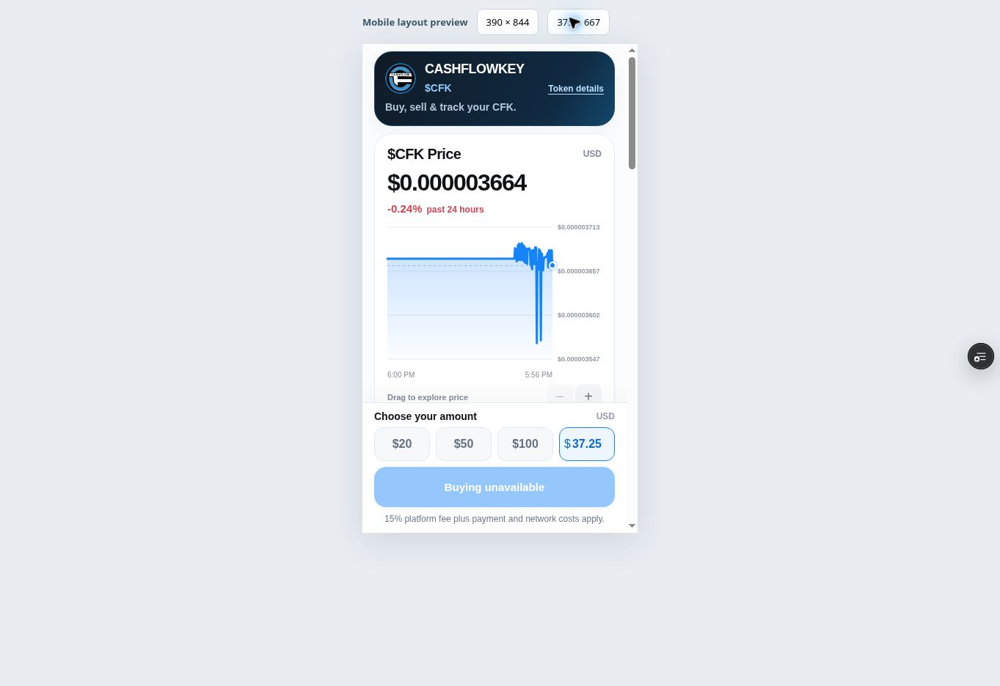
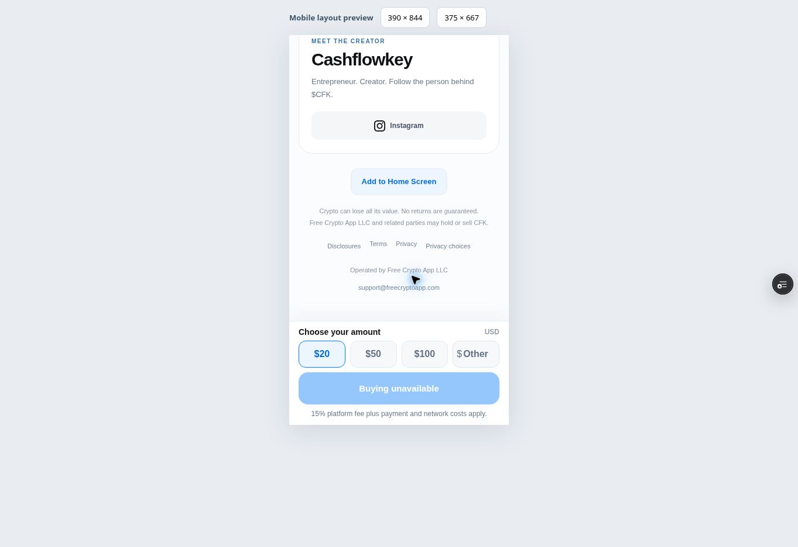

# Checkout audit — October 3, 2026

The requested experience is the BuyCFK website: choose an amount, press Buy, pay, then save the account with email. The two-click target describes the app's entry into checkout. Provider payment details, identity checks, and bank approvals can add required actions.

## Changes

| Finding | Change |
| --- | --- |
| Branded-domain visits left the website for Telegram | Render the app on the website; remove the blocking Telegram SDK and automatic handoff. |
| New buyers had to authenticate before checkout | Create a guest session after an explicit Buy action; prompt for email after funding/purchase. Retain the same user and wallet when upgrading. |
| Custom amounts required a separate dialog | Accept an inline decimal amount with validation and an amount-specific Buy button. |
| Exact `APP_URL` comparison rejected other verified production aliases | Allow only the three verified HTTPS production origins when configured for that deployment. |
| A slow email login could be interrupted by the app timeout | Keep provider-loading timeouts, but let the user finish email authentication. |
| Network requests could remain pending indefinitely or treat an HTML response as success | Bound API requests, reject malformed responses, and never automatically retry payment POST requests. |
| A position below $20 could not use the default Sell selection | Clamp the initial sale amount to the current position value and preserve explicit sale confirmation. |
| A refresh during guest connection lost the selected purchase | Preserve the chosen amount in tab storage for ten minutes, then wait for a fresh Buy tap. Existing payment recovery remains durable. |
| Price refresh failures were silent | Label stale prices and provide a retry for checkout configuration failures. |
| Email upgrade failure could make Retry do nothing | Retry the email upgrade on the existing guest session without creating another payment. |
| The chart captured vertical touch gestures | Permit vertical page scrolling and pinch zoom while retaining horizontal price inspection. |
| Returning users could have checkout opened automatically | Restore accounts quietly, keep payment recovery behind Continue, and poll checkout only while its dialog is open. |

The follow-up adds a blue Official CFK checkmark beside the coin symbol and only the requested Instagram link, `@cashflowkeyy`, at the bottom. The Instagram destination was cross-checked against [the creator's Linktree](https://linktr.ee/cashflowkey). The badge identifies this project's official token; it does not assert third-party endorsement.

The October 4 follow-up removes the remaining Telegram login option, styles, tracking handoff, and launch parameters. Existing funded authenticated accounts can link an email to the same user and wallet; inaccessible older accounts are directed to support. BotFather settings were not changed.

## Wallet and payment boundaries

- Browsing, choosing an amount, and restoring an empty account create no wallet.
- A Buy action establishes identity, then calls authenticated funding preflight. Only a ready checkout can request an on-demand Solana wallet.
- Stripe requires the destination address before accepting payment, so wallet creation happens at checkout, before funding completes.
- Existing idempotent payment attempts, verified provider receipts, finalized transaction checks, and durable recovery references remain in place.
- Failed account upgrade keeps the funded guest identity intact. Email addresses already associated with another account cannot be merged into a guest by Privy.
- Bridge has not been integrated. Cash withdrawals remain governed by the existing disabled provider flag.

## Verification and release status

All 58 tests pass and `npm run build` succeeds locally. Automated DOM tests exercise amount selection, guest connection, payment verification, automatic coin purchase, account upgrade/retry, email linking on an existing funded identity, quiet refresh/account restoration, deliberate payment recovery, disabled guest checkout, sale review, and older payment recovery. Payment, Privy, and chain responses in these tests are fixtures, not live transactions. Existing server tests cover authentic payment signatures, fee accounting, duplicate settlement, and confirmed trade idempotence.

Vercel preview `cfk-iyn708fc6-cashflowkey.vercel.app` built successfully from commit `ec8c6f4`. Browser checks confirmed desktop rendering, inline custom amount entry, and the 375 × 667 layout with no horizontal overflow. Preview configuration reports buying and guest checkout disabled, so verification stopped before creating an identity or payment. The browser console showed extension-origin metadata errors, but no application-origin errors during these checks.

The standalone follow-up preview `cfk-2nidgvo17-cashflowkey.vercel.app` is READY from commit `0cae385`. Browser checks confirmed direct website rendering, no automatically opened checkout, page scrolling, and Instagram as the only social link. The 375 × 667 layout has matching 360px document and content widths (15px scrollbar), and the chart uses `pan-y pinch-zoom`. The preview configuration still reports buying and guest checkout disabled. No application-origin console errors appeared.

On October 3, the production public app configuration reported buying enabled and withdrawals disabled. Privy's public app configuration reported email authentication enabled and guest authentication disabled. No provider settings, live balances, or real-money transactions were changed during this audit.

At 7:36 PM America/Chicago on October 3, the owner confirmed saving Guest accounts in Privy. A direct recheck from the execution environment returned Cloudflare error 1010, while the preview still returned false. The previous server check conflated provider access failures with a disabled dashboard setting. The app now uses the explicit server-side `GUEST_CHECKOUT_ENABLED` rollout flag (disabled by default), enabled only after the owner confirms dashboard configuration. This is app configuration, not independent verification of the Privy dashboard. No attempt was made to bypass the provider restriction. The official SDK still enforces Privy authentication; a rejected guest connection cannot reach funding or create a wallet/payment. Existing authenticated accounts can still access their balances and recover payments.

A controlled checkout on the production website remains necessary to verify the complete live flow; automated fixtures and configuration checks do not replace it. The local suite and build do not establish live KYC, card authorization, wallet signing, funded route execution, or cash-payout readiness. The wallet SDK remains a large deferred bundle; it is preloaded on amount interaction instead of during initial browsing.

References: [Privy guest accounts](https://docs.privy.io/authentication/user-authentication/login-methods/guest), [Stripe embedded onramp](https://docs.stripe.com/crypto/onramp/embedded), [Bridge USD payout methods](https://apidocs.bridge.xyz/get-started/guides/move-money/usd-integration-guide).
